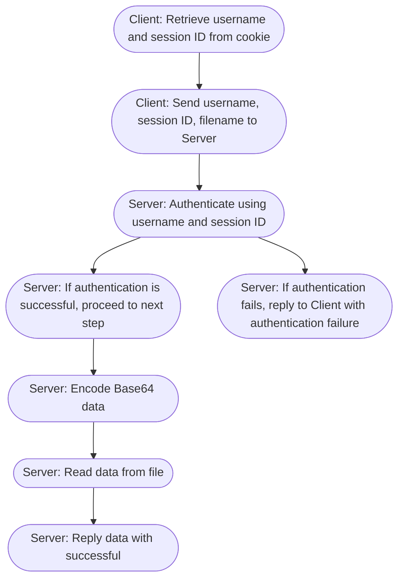
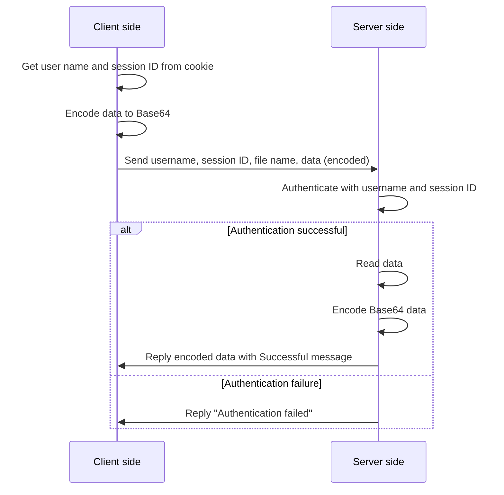

## load api

| Method | Destination   |
|:-------|:--------------|
|POST    | /cgi-bin/load |

### Algorithm


### Request body

```json
{
    "username": "USERNAME",
    "session_id": "SESSION_ID",
    "file_path": "FILEPATH",
}
```



