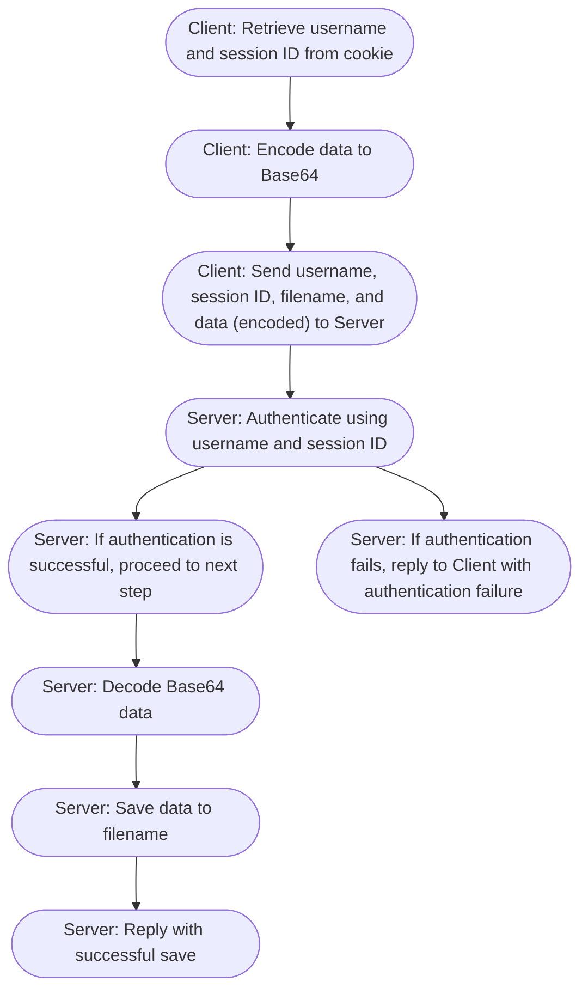
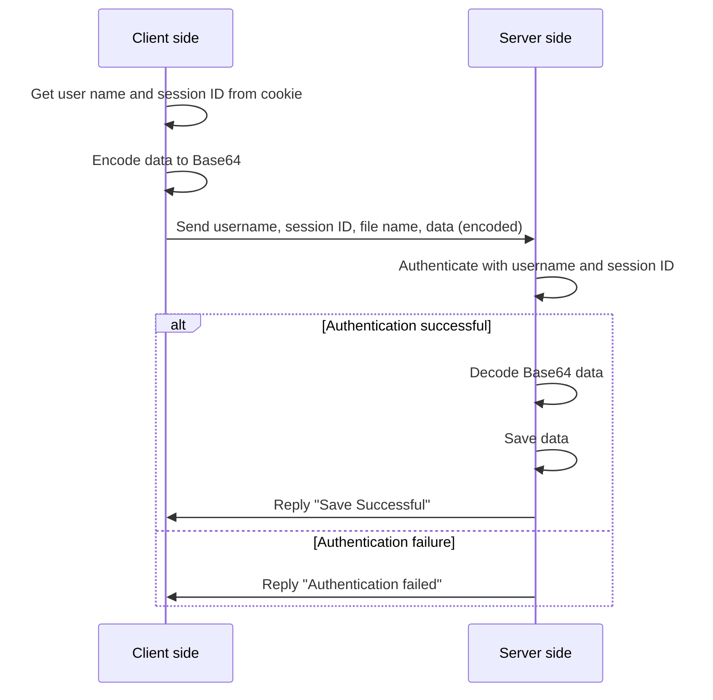

## save api

| Method | Destination   |
|:-------|:--------------|
|POST    | /cgi-bin/save |

### Algorithm


### Request body

```json
{
    "username": "USERNAME",
    "session_id": "SESSION_ID",
    "file_path": "FILEPATH",
    "data": "BASE64TEXT"
}
```



